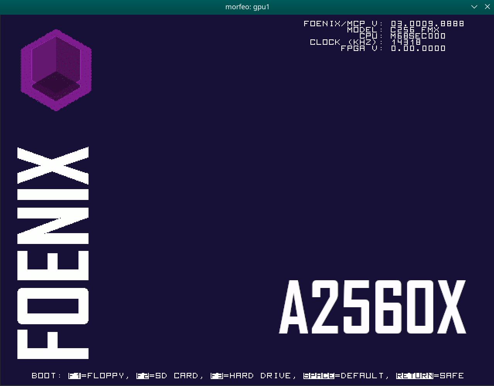
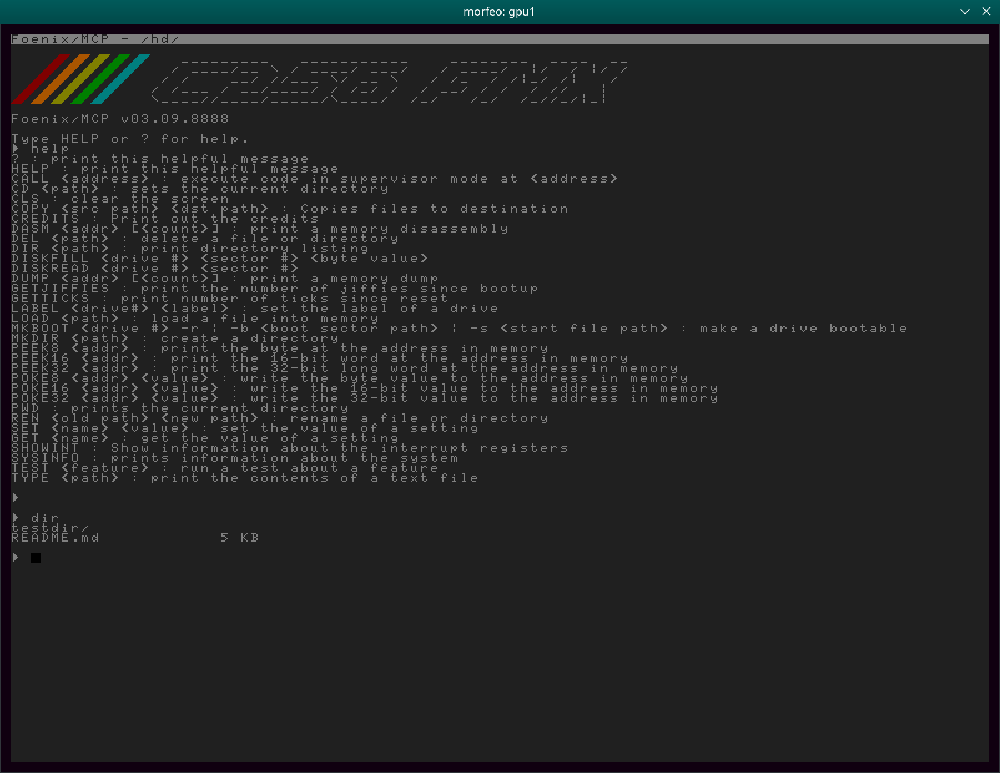
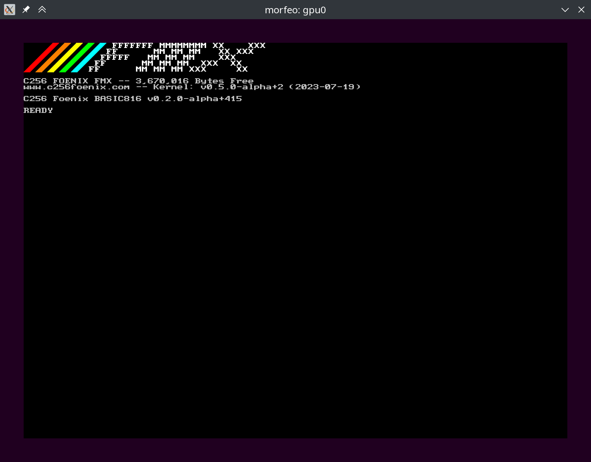

# MORFE/O - Meyer's Own Re-combinable FrankenEmulator / Odin version

So, there is - slowly evolving - emulator framework, capable for easy
emulation of various sets of CPUs, GPUs and memory models.

At this moment MORFE/O supports 32bit m68k CPU (Musashi Core) and 
provides native implementation of 16bit WDC 65C816 and 8bit 
WDC W65C02S cores.

# Word of warning

The main goal of MORFEO is to create a universal emulator, capable of emulating
different sets of hardware.

Not all assumptions for a2560x compatible system turned out to be correct for
C256 family systems, hence some code inconsistency, which will be gradually
removed.

# Available targets

## a2560x

An emulator of m68k-based of [Foenix machines](https://c256foenix.com/).
Currently only a kind of ``a2560x`` platform is supported, but morfeo
is modular and extensible...

**Warning:** current status should be considered as /pre-alpha/. Currently
only smal subset of platform is supported and debug features, like in morfe
are not implemented yet.

**Warning:** both screens are set to hi-res and GUI is fixed to x2 scale,
because of limitation of my eyes. Scaling and DIP-switches should be 
implemented in near future, I hope - but in-code resolution change works
well.

## c256

An emulator capable to run subset of features C256 FMX/U/U+ machines (but
without sound, that part has - unfortunately - low priority. At this moment
a functional FMX (boot screen, basic) is avaiable, U/U+ has minor issues
with bootscreen. 

Still lack of EVID card (second monitor), SD nor HDD - but they are on my
short TODO list.

# Some screenshots

## a2560x with MCP kernelY




## c256 FMX with stock kernel




## test_65c816

It is a test suite for an 65C816 core emulation. 

*I found - in hard way - that unit tests are not capable for find many subtle
CPU bugs. You've been warned.* 

Based on sets provided by [SingleStepTests](https://github.com/SingleStepTests)

Notes:
* STP and WAI require implementation

* tests for MVN and MVP are invalid and disabled

## test_w65c02s

It is a test suite for an W65C02S core emulation. 

*I found - in hard way - that unit tests are not capable for find many subtle
CPU bugs. You've been warned.*

Based on sets provided by [SingleStepTests](https://github.com/SingleStepTests)

Notes:
* STP and WAI require implementation

* there are not tests for STP and WAI

# Word about 65C816 and W65C02 versions

Both 65C816 and W65C02S are built on common foundation and
are subjects to further improvement.

# Building

At this moment emulator was built and tested on Ubuntu 22.04 LTS and
openSUSE Leap 15.6.

1. You need a working copy of [Odin](https://odin-lang.org/docs/install/)
   language - follow link and install Odin in preffered way.

   A ``Makefile`` assumes that ``odin`` binary is in Your ``PATH``!

2. A sdl2 development files: ``apt install libsdl2-dev`` or ``zypper
install SDL2-devel``.

3. Clone repo, update submodules and run binary:

```shell
git clone https://github.com/aniou/morfeo
cd morfeo
git submodule init lib/getargs
git submodule init external/Musashi
git submodule update
make
```

4. If You want to run test programs for 65xx-based core then You need two
additional modules.

**WARNING:** they need about 20G of additional space!

```shell
git submodule init external/tests-65816
git submodule init external/tests-6502
```

5. Type ``make`` for impatient or ``make help`` for detailed options. 

# Running a2560x

Run:

```shell
./a2560x --gpu=1 --disk0 data/test-fat32.img data/foenixmcp-a2560x.hex
```

At this moment only two keys are supported. See for standard output logs
for unsupported functions and not-implemented-yet memory regions!

|Key     |Effect
---------|---------------------------
F8       |Change active head in multi-head setups
F12      |Exit emulator

# Running c256

Run:

```shell
./c256 data/kernel_FMX.hex
```

There are two additional switches available: ``-d`` and ``-b``. First one
enables disassembler from the start - second one enables debug for writes
and reads on internal bus:

```shell
./c256 -b data/kernel_FMX.hex
...
[DEBUG] --- bus0 read8  0000005f from 0x 0039:0F7B
[DEBUG] --- bus0 read8  0000000f from 0x 0039:0F7C
[DEBUG] --- bus0 read8  00000039 from 0x 0039:0F7D
[DEBUG] --- bus0 write8 00000039   to 0x 0000:FEEF
[DEBUG] --- bus0 write8 0000000f   to 0x 0000:FEEE
[DEBUG] --- bus0 write8 0000007d   to 0x 0000:FEED
[DEBUG] --- bus0 read8  000000ea from 0x 0039:0F5F
[DEBUG] --- bus0 read8  000000ea from 0x 0039:0F60
```

At this moment only few function keys are supported. See for standard output
logs for unsupported functions and not-implemented-yet memory regions!

|Key     |Effect
---------|---------------------------
F8       |Change active head in multi-head setups
F10      |Enable rudimentary disassembler (to be improved)
F12      |Exit emulator

# FQA

### Why not morfe (an Go-based)?

Because interfacing C-libraries from Go is cumbersome and excellent m68k
core (Musashi) is written in C.

### But why Odin?!

Because I need some fun too.

### Why MCP banner is "C256 Foenix"?

Because a proper ID bits in GABE emulation part are not implemented yet.

### In which areas morfeo is better than morfe?

* clean architecture
* faster
* irq support
* timer support
* current memory map of a2560x platform
* better 65C816 implementation (**new**)
* an W65C02S implementation (**new**)

### In which areas morfeo is worse than morfe?

* lack of debugging tools for code
* ~lack of 65c816 support~
* Golang is more portable 
* more memory leaks

### What about feature XXX

In future. I have limited resources and morfe/morfeo were created as
development platform for system software, thus lack of support in 
graphics and sound

# Hacking

A crucial for understanding internal code and way in which modules
are implemented is an [union concept](https://github.com/odin-lang/Odin/blob/master/examples/demo/demo.odin#L577).

See also ``emulator/gpu/gpu.odin``, and routines ``vicky3_make`` 
and ``vicky3_read`` in ``emulator/gpu/gpu_vicky3.odin`` for samples.

# Included software

That project include:

* [getargs](https://github.com/jasonKercher/getargs) module
* [Musashi](https://github.com/kstenerud/Musashi) core
* a ``hex.odin`` file imported (and tweaked) from Odin core library 

