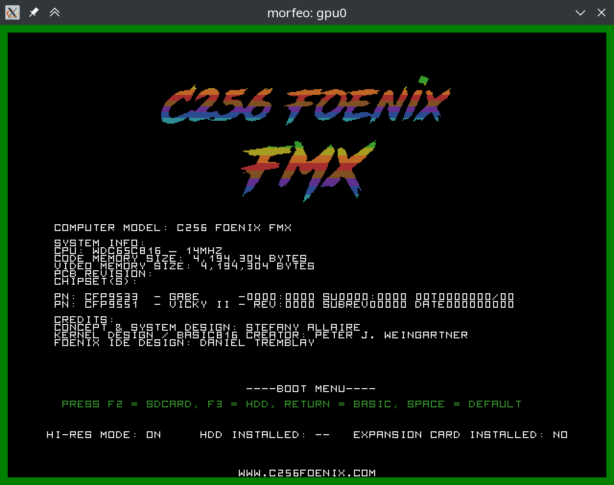

# MORFE/O - Meyer's Own Re-combinable FrankenEmulator / Odin version

So, there is - slowly evolving - emulator framework, capable for easy
emulation of various sets of CPUs, GPUs and memory models.

At this moment MORFE/O supports 32bit m68k CPU (Musashi Core) and 
provides native implementation of 16bit WDC 65C816 and 8bit 
WDC W65C02S cores.

> [!WARNING]
> Currently only small subset of platform is supported and software
> itself is in infancy.

> [!NOTE]
> If You have an SID-emulating library in C or wrapper around
> C++ reSID code - let me know! 

# Available targets

## a2560x

An emulator of m68k-based of [Foenix machines](https://c256foenix.com/).

Currently only a kind of ``a2560x`` platform is supported, but morfeo
is modular and extensible...

## c256fmx, c256u, c256u+

An emulator capable to run subset of features C256 FMX/U/U+ machines, but
without sound. 

At this moment has better quality (config files, switches) than a2560-one. 

## test_65c816 and test_w65c02s

Test suites for cores, based on sets provided by [SingleStepTests](https://github.com/SingleStepTests)

Notes:
* STP and WAI require implementation

* tests for MVN and MVP are invalid and disabled (but opcodes works!)

# Building

At this moment emulator was built and tested on Ubuntu 22.04 LTS and
openSUSE Leap 15.6.

1. You need a working copy of [Odin](https://odin-lang.org/docs/install/)
   language - follow link and install Odin in preffered way.

   A ``Makefile`` assumes that ``odin`` binary is in Your ``PATH``!

2. A sdl2 development files: ``apt install libsdl2-dev`` or ``zypper
install SDL2-devel``.

3. Clone repo, update submodules and run binary:

```shell
git clone https://github.com/aniou/morfeo
cd morfeo
git submodule init lib/getargs
git submodule init lib/odin-ini-parser
git submodule init external/Musashi
git submodule update
make
```

4. If You want to run test programs for 65xx-based core then You need two
additional modules.

**WARNING:** they need about 20G of additional space!

```shell
git submodule init external/tests-65816
git submodule init external/tests-6502
```

5. Type ``make`` for impatient or ``make help`` for detailed options. 

# Running a2560x

Run:

```shell
./a2560x --gpu=1 --disk0 data/test-fat32.img data/foenixmcp-a2560x.hex
```

At this moment only two keys are supported. See for standard output logs
for unsupported functions and not-implemented-yet memory regions!

|Key     |Effect
---------|---------------------------
F8       |Change active head in multi-head setups
F12      |Exit emulator

# Running c256*

Just use command (``c256fmx``, ``c256u``, ``c256u+``). Configuration will
be loaded automagically from default file ``conf/[binaryname].ini``

Particular settings may be overrided by CLI switches. 

Following command will run emulator in low-res mode, even if ``.ini`` file 
has ``DIP6`` set to value ``on``.

```shell
./c256fmx --dip6 off
```

Additional ``hex`` files may be loaded by providing filename after command,
there is no need to change ``ini`` file for every case:

```shell
./c256fmx data/tetris.hex
```

Configuration file may be selected by ``--cfg path_to/file.ini`` switch 
or  bypassed at all by ``--nc`` flag.

There are two additional switches available: ``-d`` and ``-b``. First one
enables disassembler from the start - second one enables debug for writes
and reads on internal bus. 

```shell
./c256fmx -b
...
[DEBUG] --- bus0 read8  0000005f from 0x 0039:0F7B
[DEBUG] --- bus0 read8  0000000f from 0x 0039:0F7C
[DEBUG] --- bus0 read8  00000039 from 0x 0039:0F7D
[DEBUG] --- bus0 write8 00000039   to 0x 0000:FEEF
[DEBUG] --- bus0 write8 0000000f   to 0x 0000:FEEE
[DEBUG] --- bus0 write8 0000007d   to 0x 0000:FEED
[DEBUG] --- bus0 read8  000000ea from 0x 0039:0F5F
[DEBUG] --- bus0 read8  000000ea from 0x 0039:0F60
```

At this moment only few function keys are supported. See for standard output
logs for unsupported functions and not-implemented-yet memory regions!

|Key     |Effect
---------|---------------------------
F7       |Load and run Daniel's Tremblay Tetris
F8       |Switch between main and EVID-200 GPU
F9       |Enable/disable bus operation dump
F10      |Enable/disable rudimentary disassembler (to be improved)
F11      |Reset 
F12      |Exit emulator

# FQA

### Why not morfe (an Go-based)?

Because interfacing C-libraries from Go is cumbersome and excellent m68k
core (Musashi) is written in C.

### But why Odin?!

Because I need some fun too.

### Why MCP banner is "C256 Foenix"?

Because a proper ID bits in GABE emulation part are not implemented yet.

### In which areas morfeo is better than morfe?

* clean architecture
* faster
* irq support
* timer support
* current memory map of a2560x platform
* better 65C816 implementation (**new**)
* an W65C02S implementation (**new**)

### In which areas morfeo is worse than morfe?

* lack of debugging tools for code
* ~lack of 65c816 support~
* Golang is more portable 
* more memory leaks

### What about feature XXX?

In future. I have limited resources and morfe/morfeo were created as
development platform for system software, thus lack of support in 
graphics and sound.

At this moment on my short TODO list are:

- [ ] better debug facilities for c256
- [ ] tiles for c256
- [ ] modernisation of a2560x to standard (config file etc.) of c256
- [ ] EVID 200 (second monitor) extension card

# Hacking

An preliminary documentation about internals is available in 
[doc\internals](https://github.com/aniou/morfeo/blob/master/doc/internals/README.md)
directory. 

A crucial for understanding internal code and way in which modules
are implemented is an [union concept](https://github.com/odin-lang/Odin/blob/master/examples/demo/demo.odin#L577).

See also ``emulator/gpu/gpu.odin``, and routines ``vicky3_make`` 
and ``vicky3_read`` in ``emulator/gpu/gpu_vicky3.odin`` for samples.

# Included software

That project include:

* [getargs](https://github.com/jasonKercher/getargs) module
* [odin-ini-parser](https://github.com/laytan/odin-ini-parser) module
* [Musashi](https://github.com/kstenerud/Musashi) core
* a ``hex.odin`` file imported (and tweaked) from Odin core library 
* [C256 Tetris](https://github.com/dtremblay/c256-tetris) binary by Daniel Tremblay
* copy of [official MFX/U/U+ kernel](https://github.com/Trinity-11/Kernel_FMX)

# Some screenshots

## a2560x with MCP kernel


## c256 FMX with stock kernel




