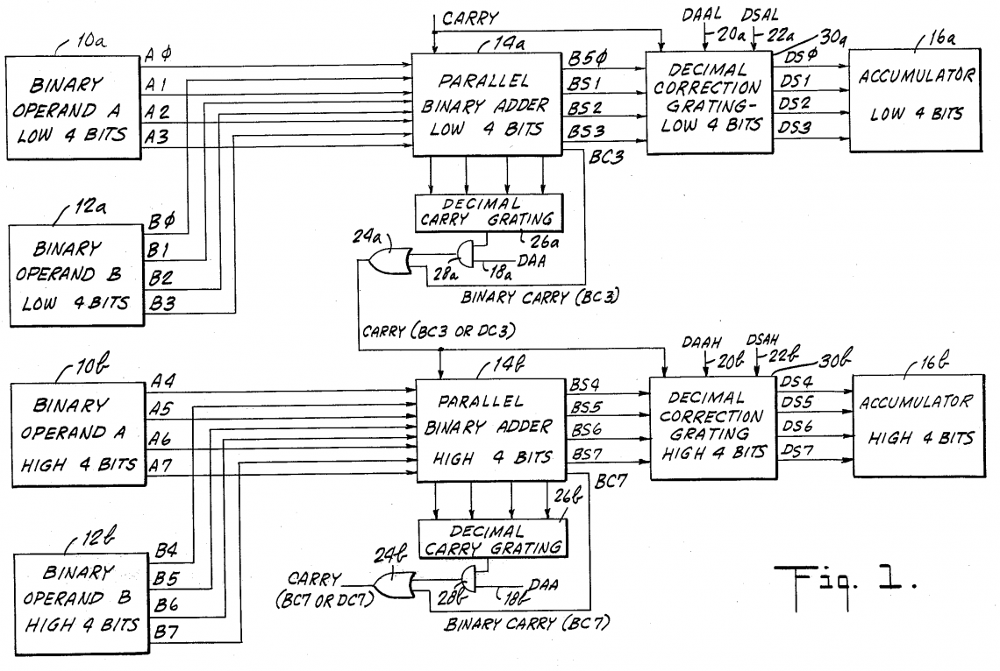

===============================================================================
Implementation of ADC and SBC operands on 65C02/65C816 family
===============================================================================

:Author:  Piotr Meyer
:Contact: [firstname.lastname]@gmail.com
:Address: https://github.com/aniou/morfeo/
:Date:    2023-09-07
:Version: 1.1

Introduction
-------------------------------------------------------------------------------
ADC and SBC commands are considered as most cumbersome and complicated 
ones to emulate, thanks to BCD mode and subtle differences in handling
in different flavours of CPU (6502, W65C02, 65C816 in both modes).

Fortunately, there are numerous valuable documents, available in Internet,
see `Bibliography`_ part - but available algorithms are still complicated
and there is a room to improve their clarity.

In this document I want to show an attempt to achieve balance between
mathematical abstract of BCD algorithm, like in [Clar2016]_ and strict
simulation of individual logic gates. I wanted code, that will be 
self-documenting and reflecting logical steps and blocks of CPU, but 
is also readable. And because of that I chose, for example, a simple 
math  (like ``+`` or ``-``) in place of series of XOR's on particular bits.

Some basics
-------------------------------------------------------------------------------
Although there are two commands: SBC that means 'SuBtract with Carry' and
ADC, 'ADd with Carry', CPU itself uses only one kind of logical blocks for
that operation: set of binary adders alongside with two decimal correction
gratings. In 6502 we have a two 4-bit adders, probably 65C816 has four,
because of support of 16-bit numbers, but there is no available schemes of
65C02/65C816 due to intellectual property protection.

Fortunately, there is a block diagram from U.S. Patent 3,991,307 (1976),
that describes general adder, carry and decimal correction gratings. It
is a good place to start:

   U.S. Patent US-3991307-A (1976/11/09) Sheet 1 of 3

.. Note:: Those, interested in details should take a look at article about MOS 
          Binary/BCD adder patent [Sang2019]_ and at patent itself: [6502adder]_.

The subtraction operation is possible due to specific property of binary system:
the subtraction of two arguments: ``ar1`` - ``ar2`` may be replaced by addition 
of ``ar1`` and `two's complement`_ of ``ar2``.

Calculating two's complement is simple: we need to flip (invert) all bits in
argument and then **add one to that argument**, ignoring any overflow, so
operation like ``09 - 02`` can be implemented in following way:

Preparing arguments::

  ar1 (09)      : 1001   <= our first argument
  ar2 (02)      : 0010
  ar2 xor F     : 1101
  ar2 xor F + 1 : 1110   <= our second argument

Math::

     1001  (09)
  +  1110  (two's complement of 2)   
    -----
     0111  (07)

In that way CPU is able to handle both subtraction and addition with single set
of logic gates: although I implemented two, separate - but similar - routines.
It was intentional - there is a possibility to create single, universal
procedure, but I wanted to simplify things to bare minimum to give a simple way
to understand whole process - and more universal code, created with DRY 
principle, would require extra booleans and conditions, that would have negative
impact on clarity.

Following routines pass all available tests ([SSTest]_, [6502func-ca65]_) for
65C02 and 65C816 in native and emulation mode. They were not tested on MOS6502
behaviour, although there is a possibility to improve that situation in future.

Variables
-------------------------------------------------------------------------------
b0-b3
  A products of 4-bit binary addition (subtraction)

d0-d3
  Result of decimal correction (if required) or simply copy of ``b0-b3``.
  It reassembles a block flow from `patent`_: ``adder -> correction -> A``

bc0-bc3
  Binary Carry status

dc0
  Decimal Carry status: it has effect only in two cases: 

  a) decimal add
  
  b) additional decimal carry in subtract on physical 65C02 (but not on
     65C816 in emulation mode). Thus we need only one variable, to pass
     information from first, 4-bit adder, to second.

real6502
  Emulator-specific variable that denotes "real" 65C02 and not 65C816 in
  emulation mode, it has meaning for digital carry application, specific 
  for that particular model

f.D, f.C, f.N, f.Z
  CPU status flags

A
  Accumulator, i.e. A register

Overflow flag (V)
-------------------------------------------------------------------------------
There are two, excellent articles about V flag: one by Bruce Clark [Clark2004]_
and second, by Ken Shirriff [Shir2012]_. It is rather well-described topic, for
my code I chose a way described by following code (for 8-bit operation)::

    arg_sign_eq     = ((ar1 ~ ar2 )  &   0x80) == 0
    prod_sign_neq   = ((ar2 ~ b1  )  &   0x80) != 0
    V               = arg_sign_eq && prod_sign_neq

It is worth to mention that ``V`` flag is always (6502, 65C02 etc.) calculated
from **binary** product, not decimal one, even if ``D`` flag is set.

Coding convention
-------------------------------------------------------------------------------
Following code is written in `Odin`_ - but code itself is so simple that it can 
be translated in 1:1 to almost any language and reader may treat it as kind of 
pseudocode.

The routines use a simple coding convention, when syntax like ``a += 1`` 
means ``a = a + 1`` and operators like ``&``, ``|``, ``~`` corresponds to
bitwise ``and``, ``or`` and ``xor``. A construct ``u16(...)`` means *cast
to 16-bit unsigned int*.

Just for convenience I used a 32-bit variables for 16-bit (65c816) operations,
because it is easy to test overflow (carry) by testing bit 9 (for 8-bit) or 17
(for 16-bit operations), thus it needs vars of size larger then size of
arguments and product. Because of that there are number of operations like ``b0
&= 0x000f`` where we are clearing unused bits. They don't have an equivalent in
CPU, but they are necessary in general programming language, when we use
a variables larger in size.

A single conditional in form ``val1  if  condition  else  val2`` should be
read as: *if condition is true use val1 - else use val2*. In some cases
code like ``b0 += 0x0006 if something else 0`` may be replaced by more
familiar ``if something { b0 += 0x0006 }`` but former construct provides
more - in my opinion - pleasant notation: more regular, more like a set 
of assembly instructions.  It is only a matter of aesthetics, though.

The code itself is more redundant than it needs, but I wanted to show
clear and very simple way of doing things. Those, interested in detailed
emulation of real HW behaviour should take a look at notes in `More accurate
emulation`_

ADC
-------------------------------------------------------------------------------
Following code is visually divided on two adders (or four for 16-bit
operations), responsible for operation on 4-bit values. It is clearly visible
from masks and arguments in particular (described above) steps: ``0x000f``
means *lowest 4bit nybble*, ``0x00f0`` means *next nybble* and so on, through
``0x0f00`` to ``0xf000``.

The same is with carry calculation or decimal correction, when ``0x0006`` is
added (or subtracted) from lowest nybble, then ``0x0060`` on next and so on.
It spares code from endless right and left shifts.

Carry bit for the operation is based on last Carry (``f.C``) state and ``V``
flag is calculated from sign of arguments and sign of highest bit of ``binary``
calculation, regardless of ``D`` bit state.

Arguments::

    ar1       = [first argument]
    ar2       = [second argument]

First adder::

    // step 1: add values and carry
    b0        = ar1 & 0x000f
    b0       += ar2 & 0x000f
    b0       +=       0x0001 if        f.C             else 0

    // step 2: check carry (digital and binary)
    dc0       = b0  > 0x0009
    bc0       = b0  > 0x000f
    f.C       = bc0  | dc0   if f.D                    else bc0

    // step 3: digital correction
    d0        = b0  & 0x000f
    d0       +=       0x0006 if f.D & f.C              else 0
    d0       &=       0x000f

Second adder::

    // step 1: add values and carry
    b1        = ar1 & 0x00f0
    b1       += ar2 & 0x00f0
    b1       +=       0x0010  if       f.C             else 0

    // step 2: check carry (digital and binary)
    dc1       = b1  > 0x0090
    bc1       = b1  > 0x00f0
    f.C       = bc1  | dc1    if f.D                   else bc1

    // step 3: digital correction
    d1        = b1  & 0x00f0
    d1       +=       0x0060  if f.D & f.C             else 0
    d1       &=       0x00f0

Finalize::
        
    A         = u16(d1 | d0)
    f.V       = test_v(ar1, ar2, b1)
    f.N       = test_n( A )
    f.Z       = test_z( A )

SBC
-------------------------------------------------------------------------------
In case of subtraction operation there are some differences, described below:
the code for ADC and SBC may be (and should be if someone is interested in
emulation of very accurate hardware layout) merged into single procedure,
although in that case one should consider providing additional, separate bools:
``DAA`` for signal *decimal add operation* and ``DSA`` for *decimal subtract*.

First difference we can see is in preparing arguments. ``SBC`` routine makes 
a bit flip of second argument (like ALU in 6502). That gives us a **one's 
complement** of argument, not **two's complement** required for successful
replacement subtraction by addition (see: `Some basics`_ section).

It is a decision of CPU creators and specific trait of that processor: one must
manually set ``C`` flag before subtraction, otherwise product will be less by 
one than expected. At cost of a single command it allows to chain ``ADC/SBC``
commands to operate on larger numbers and spare a fistful of logic gates.

In my code I deliberately chose conformation to hardware behaviour and step
1 in both routines looks the same: add arguments then add a Carry.

Step 2 is different - in 6502 `patent`_ we can see that combining binary and
decimal carry is inhibited when ``DAA`` line is low, thus - for subtracting
only binary carry is used. I can replicate that in code at expense of extra
conditionals, but I chose simpler approach.

Step 3 is also different from ``ADC`` and from the rest of code. I deliberately
chose subtraction operation ``-6`` in place of real ``+10`` for decimal
correction, because even if former is conform with real hardware, it also
introduces unnecessary complexity for reader. Step 1 and 2 are visible to 
a programmer, because of requirements of setting ``C`` flag before operation:
internals of decimal correction are hidden.

In that step there is also additional code - calculation of decimal carry
(``dc0``) after decimal correction and propagation to next adder.

It is a behaviour described and observed on "real" 65C02 chips and doesn't
exists in emulated mode of 65C816. Because of that an extra variable
(``real65c02``) was provided.

Finally - ``V`` flag is calculated from arguments and binary product, but in that
case ``ar2`` has flipped bits (during argument preparation section).

Arguments::

    ar1      := [first argument]
    ar2      := [8 bit value]
    ar2       = ~ar2

First adder::

    // step 1: add values and carry
    b0        = ar1 & 0x000f
    b0       += ar2 & 0x000f
    b0       +=       0x0001 if  f.C                   else 0

    // step 2: check carry (only binary for SBC)
    bc0       = b0 >  0x000f
    f.C       = bc0

    // step 3: digital correction and digital carry
    d0        = b0  & 0x000f
    d0       -=       0x0006 if !f.C & f.D             else 0
    
    dc0       = d0  > 0x000F
    d0       &=       0x000f

Second adder::

    // step 1: add values and carry
    b1        = ar1 & 0x00f0
    b1       += ar2 & 0x00f0
    b1       +=       0x0010 if  f.C                   else 0

    // step 2: check carry (only binary for SBC)
    bc1       = b1 >  0x00f0
    f.C       = bc1

    // step 3: digital correction and digital carry
    d1        = b1  & 0x00f0
    d1       -=       0x0060 if !f.C & f.D             else 0
    d1       -=       0x0010 if  dc0 & f.D & real65c02 else 0
    d1       &=       0x00f0

Finalize::

    A         = u16(d1 | d0)
    f.V       = test_v(ar1, ar2, b1)
    f.N       = test_n( A )
    f.Z       = test_z( A )

More accurate emulation
-------------------------------------------------------------------------------
As it was said: there is one set of adders/decimal correction gratings and so 
on for both ``SBC`` and ``ADC`` operations. There are some notes for those, who 
are interested in most compatible emulation (or even simulation) of 6502:

1. First of all - take a look at Kevin's article *"The MOS 6502’s Parallel Binary
   /BCD Adder patent"* [Sang2019]_ and `patent`_ itself, because those documents 
   show, how to calculate sum and carries by gate operations (XOR, AND, NOT...), 
   so there is a way to get rid every ``+=`` and ``-=`` from code.

   It is also worthwhile to take a look on a diagram from Dieter Mueller,
   [Muel2006]_ because it is a nice and simple way to show, how ``DSA`` and
   ``DAA`` flags may be combined with carry results.

2. For calculation of decimal correction one should consider that complement's
   two of 6 has one, interesting property - a difference in two, highest bits::

    0110   (6)  
    1010   (10: complement's two of 6)
                       
                   * * 1 0
                   | |
       DSA -------/   \------- DAA
    
   Thus, we can form value in digital corrector from ``DSA`` and ``DAA`` lines,
   because of that we need to emulate them as separate entities, not just boolean
   for *is this an add operation?*. 

3. Both blocks can be easily merged into single routine or decomposed to
   multiple, specialized routines. During my tests I took that approach but
   then I realized, that it has negative impact on simplicity and clarity,
   which were a priority for that project: tracking calls between routines and
   shifts *by 4, 8 and 12 bits* as well as handling additional variables is
   - in my opinion - more cumbersome that simply looking at ``+ 0x0006`` and
   interpreting it with no time as *add 6 to first nybble*, ``+ 0x0060`` as
   *add 6 to second nybble* and so on.

Bibliography
-------------------------------------------------------------------------------

.. [Clar2016] Bruce Clark (2016) 

   "Decimal Mode"

   http://www.6502.org/tutorials/decimal_mode.html

.. [Sang2019] Kevin Sangeelee (2019)          

   "The MOS 6502’s Parallel Binary/BCD Adder patent"

   https://www.susa.net/wordpress/2019/05/the-mos-6502s-parallel-binary-bcd-adder-patent/

.. [Clark2004] Bruce Clark (2004)

   "The Overflow (V) Flag Explained"

   http://www.6502.org/tutorials/vflag.html

.. [Shir2012] Ken Shirriff (2012)

   "The 6502 overflow flag explained mathematically"

   http://www.righto.com/2012/12/the-6502-overflow-flag-explained.html

.. [Muel2006] Dieter Mueller (2006)

   "BCD / A simple implementation"

   http://6502.org/users/dieter/bcd/bcd_2.htm

.. [SSTest] Tom Harte (2024)

   "SingleStepTests / ProcessorTests"

   https://github.com/SingleStepTests

.. [6502func] Bruce Clark, Klaus Dorman and others

   "6502_65C02_functional_tests"

   https://github.com/Klaus2m5/6502_65C02_functional_tests

.. [6502func-ca65] Bruce Clark, Kalus Dorman and uknown

   "6502_65C02_functional_tests for CA65"
   
   https://github.com/Kowloon-walled-City/6502_65C02_functional_tests

.. [6502adder] Jed Margolin (2001)

   "A Word (or more) about the 6502"

   http://www.jmargolin.com/patents/6502.htm

.. _`two's complement`: https://en.wikipedia.org/wiki/Two%27s_complement
.. _`Odin`:             https://odin-lang.org/
.. _`patent`:           http://www.jmargolin.com/patents/3991307.pdf
